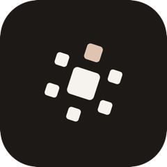

  

<h1 align="center">Antria</h1>

<strong>Run your own AI team.</strong>

  A full team of AI specialists you run from your desk — they do the actual work 
  and hand you the finished files. On the plan you already pay for. Private, on your own computer.

  <a href="https://github.com/nimishmehta/antria-ai/releases/latest/download/Antria-universal.dmg"><b>⬇ Download for Mac</b></a>
  &nbsp;·&nbsp;
  <a href="https://github.com/nimishmehta/antria-ai/releases/latest/download/Antria-Setup.exe"><b>⬇ Download for Windows</b></a>
  &nbsp;·&nbsp;
  <a href="https://www.antria.ai"><b>antria.ai</b></a>

---

## What is Antria?

Antria is a desktop app that gives non-technical solo builders a full AI company — a founder,
engineer, designer, copywriter, and more — running on your own Claude Pro or Max plan, entirely
on your device. Nothing runs in our cloud. And the longer you use it, the more it becomes *your*
team: Antria learns your tone, your formats, and how you like work done, then reflects that in
everything it produces next.

## Why people use it

- **Real roles, real skills, one shared job.** Each teammate has a clear role and a set of
  battle-tested skills — they don't just chat, they produce.
- **Finished work, not summaries of work.** You get the actual spreadsheet, doc, deck, site, or
  design — the file you open — not a description of what an assistant "would" do.
- **Watch them think, not just deliver.** See the office work in real time: who's on what,
  what's blocked, what shipped.
- **Your company stays on your computer.** Your files and context never leave your machine.
- **Put a team on it tonight.** Start a task, close the lid, come back to finished work.

## Learns how you work

Antria watches how you refine things — the rewrites you ask for, the formats you settle on, the
way you like an email or a doc to read — and quietly remembers your preferences on your device.
Every future task starts from what it already knows about you, so you spend less time correcting
and more time shipping. You can open the "What Antria learned about you" panel at any point to
see, edit, or delete what it's picked up.

- **On-device memory** — preferences are stored locally, never in the cloud or with the model.
- **Learns from real work** — it picks up your style from how you edit and re-prompt, not from a setup form.
- **Applies everywhere** — your voice and formats carry across emails, docs, decks, and code.
- **Fully transparent** — a single panel shows everything the team has learned about you.
- **Yours to control** — edit or delete any learned preference at any time.
- **Gets better over time** — the more you work with your team, the more it sounds like you.

## Download

| Platform | Download |
| --- | --- |
| **macOS** (Apple Silicon + Intel) | [Antria-universal.dmg](https://github.com/nimishmehta/antria-ai/releases/latest/download/Antria-universal.dmg) |
| **Windows** | [Antria-Setup.exe](https://github.com/nimishmehta/antria-ai/releases/latest/download/Antria-Setup.exe) |

These links always point to the latest release. The Mac build is notarized by Apple; the app
updates itself as new versions ship.

## Built on an open harness

The part of Antria that makes the team feel like colleagues rather than chatbots — how work
gets staffed to the right specialists, when one of them stops to ask you something instead of
guessing, and how finished work comes back in plain English — is open source.

**[antria-office](https://github.com/nimishmehta/antria-office)** is that harness, published on
its own under the MIT licence. It's a plugin for Claude Cowork and Claude Code that puts the
same twenty-specialist office behind a plain-English request, with no app required.

Antria is the desktop app built on top of it: the same team, plus a real interface, your own
folders, work that keeps running after you close the lid, and no terminal anywhere in sight.

If you want to change how the team *behaves* — sharpen a role, add one, change when a
specialist stops to ask you something — that work happens in
[antria-office](https://github.com/nimishmehta/antria-office), and it takes pull requests.

## Learn more

Everything — how it works, the full team, and what it can do — is at **[antria.ai](https://www.antria.ai)**.

---

## Project

| | |
| --- | --- |
| Report a bug or request a feature | [Issues](https://github.com/nimishmehta/antria-ai/issues) |
| Getting help | [SUPPORT.md](SUPPORT.md) |
| What's welcome here | [CONTRIBUTING.md](CONTRIBUTING.md) |
| Reporting a vulnerability | [SECURITY.md](SECURITY.md) |
| Ground rules | [CODE_OF_CONDUCT.md](CODE_OF_CONDUCT.md) |
| Licence | [LICENSE](LICENSE) — the app is free to use and proprietary; the [harness](https://github.com/nimishmehta/antria-office) is MIT |

Antria is free, runs on the AI plan you already pay for, and keeps your work on your own
computer.

---

© Antria · Run your own AI team

