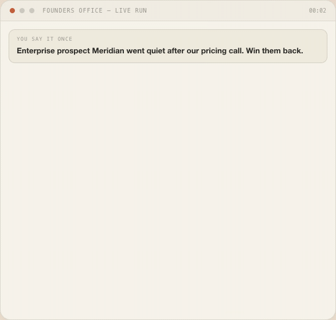

# Founders Office
### Run your own AI team.

**One sentence in. A whole team on it.**

Founders Office runs a team of AI teammates on the Claude account you already have — a strategist, a writer, an engineer, a closer — who actually talk to each other before they hand you the work. One bot guesses in a straight line. A team pushes back, fills the gaps, and catches what you'd have missed.

 

 

*Always grabs the newest build.*

`NO SIGNUP` · `NO SECOND SUBSCRIPTION` · `WORKS WITH THE CLAUDE ACCOUNT YOU ALREADY HAVE`

---

## Watch them think, not just deliver

The work isn't the file at the end — it's the room getting there. A strategist, a writer, an engineer, and a closer work the problem together, out loud, before anything reaches you.

## Meet the team

Real roles. Real skills. One shared job.

These aren't personas with different labels. Each one carries hand-tested playbooks that have shipped real work. You don't hand out separate tasks and collect the pieces — you hand over a problem.

**Founder** (Direction & Grounding) · **Chief of Staff** · **Copywriter** · **GTM Strategist** · **Marketing Lead** · **Designer** · **Engineer** · **Finance** · **Analyst** · **Reviewer**

## The biggest gain

A team left alone will hand you something polished and wrong. So a Founder sits on every job — it steps in mid-work, rejects drafts that drifted, and pulls the team back to what you actually asked for before anything reaches you.

> "I built this because I'd become the blocker in my own company — the one person ten things waited on. I ran my real work through it for six months before letting anyone else near it. I didn't want advice. I wanted a team that would do the work, on my machine."
>
> — **Nimish**, built it because he needed it

## What you get

Finished work. Not summaries of work.

<table>
<tr>
<td align="center" width="20%"> <b>Documents</b></td>
<td align="center" width="20%"> <b>Decks</b></td>
<td align="center" width="20%"> <b>Websites</b></td>
<td align="center" width="20%"> <b>Spreadsheets</b></td>
<td align="center" width="20%"> <b>Outreach</b></td>
</tr>
</table>

## Private by default

Your company stays on your computer. Most tools ask you to hand your company to their cloud and pay them monthly for the privilege. This one runs where your work already lives, on an account you already have.

## Built on battle-tested skills

Credit where it's due — built on ideas and skills from Paul Graham, gstack (Garry Tan), Get Shit Done (TÂCHES), Graphify + Caveman, and the wider skill community.

## Download

Always points to the newest release.

**Mac:** download the `.dmg`, then drag Founders Office into Applications.
**Windows:** download the `.exe` installer, then run it.

Either way: open the app, log in with your existing Claude Code account, point it at a folder, and say one sentence. Your team gets to work.

## FAQ

**Isn't a team just one model talking to itself?** No — each role runs its own pass with its own playbook and checks the others' work before it reaches you, the same way a real team catches each other's mistakes.

**What about hallucination?** The Founder role's whole job is to catch drift and reject work that doesn't hold up before it gets to you.

**Does this cost extra on top of Claude?** No separate subscription — it runs on the Claude Code account you already pay for.

**Do I need to be technical?** No terminal, no code. Point it at a folder and describe what you need in plain language.

**Can it send things on its own?** No — anything outward-facing (sending, publishing, paying) stops and asks you first.

**What if I want changes?** Just say so — the team revises in place.

---

**Put a team on it tonight.**

Download it, point it at a folder, say one sentence. Bring your own Claude Code — that's the whole setup.

`NO SIGNUP` · `NO SECOND SUBSCRIPTION` · `DELIVERABLES STAY LOCAL`

 

FOUNDERS OFFICE — RUN YOUR OWN AI TEAM
© 2026

